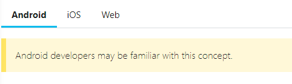

# Giới thiệu

::: details Mục lục
[[toc]]
:::

## Cách dùng tài liệu

Có thể đọc như 1 cuốn sách hoặc chỉ đọc những section bạn cần

## Điều kiện tiên quyết

Có kiến thức JS

::: warning Lưu ý
Mặc dù chúng tôi giả định người đọc không có kiến thức về React, Android, ISO development. Đây là những kiến thứ cần thiết cho React Native developer, ở chỗ thích hợp chúng ta sẽ tìm hiểu thêm 
:::

## Ví dụ tương tác

Dùng `Expo Snack Player` để run và share React Native ngay trên web hoặc cài đặt môi trường và chạy local

## Function Components và Class Components

Đầu tiên, chỉ Class component mới có state nhưng từ khi Hook được giới thiệu thì có thể thêm state cho Function Components ([Hook được giới thiệu trong React Native 0.59](https://reactnative.dev/blog/2019/03/12/releasing-react-native-059)). Vì Hooks là tính năng phổ biến trong tương lai để viết React components nên ta sẽ dùng **Function Components**, thỉnh thoảng khi cần thì dùng Class Components

Xem thêm ví dụ về Class Component ở [những docs version cũ](https://reactnative.dev/versions)

## Ghi chú cho developer

Dev có thể đã có kiển thức ở Android, iOS, Web chuyển sang học React Native. Thỉnh thoảng chúng tôi sẽ có note cho những dev có kiến thức ở những phần cụ thể này VD:

## Formatting

Menu paths được viết bằng chữ đậm và dấu caret VD: **Android Studio > Preferences**
