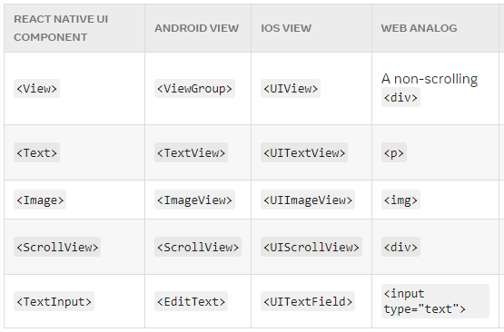

# Core Components và Native Components

::: details Mục lục
[[toc]]
:::

React Native là open source framework để xây dựng ứng dụng Android, IOS bằng [React](https://reactjs.org/) và native của platform. Ta sẽ tìm hiểu components hoạt động như thế nào trong React Native

## Views và Mobile development

**Views:** text, image, button... đều là 1 dạng view, các view có thể lồng nhau

<i>sự giống nhau giữa view trong Android và IOS</i>

## Native Components

Trong IOS thì view viêt bằng Swift, Objective-C, trong Android thì view viết bằng Kotlin, Java. Trong React Native bạn viết các React components. Trong khi runtime nó sẽ được React Native dịch sang các Android, IOS view tương ứng. Các Android, ISO view chống lưng cho React component đó được gọi là **Native Components**. Vì được dịch sang native component nên React Native app không khác gì các app native.

React Native đã có sẵn bộ React component thiết yếu, được chống lưng bởi các **Native Components**, chúng được gọi là **Core Components**

React Native cho phép bạn xậy dựng các Native Components của riêng bạn cho [Android](https://reactnative.dev/docs/native-components-android) hoặc [IOS](https://reactnative.dev/docs/native-components-ios). Ngoài ra còn có hệ sinh thái component được cung cấp bởi cộng đồng, xem ở đây [Native Directory](https://reactnative.directory/)

## Core Components

React Native cung cấp nhiều Core components có thể xem [ở đây](https://reactnative.dev/docs/components-and-apis). Một vài Core component hay dùng:

Vì React Native có cùng API structure với React components, nên phần tiếp theo ta sẽ tìm hiểu cơ bản về React

