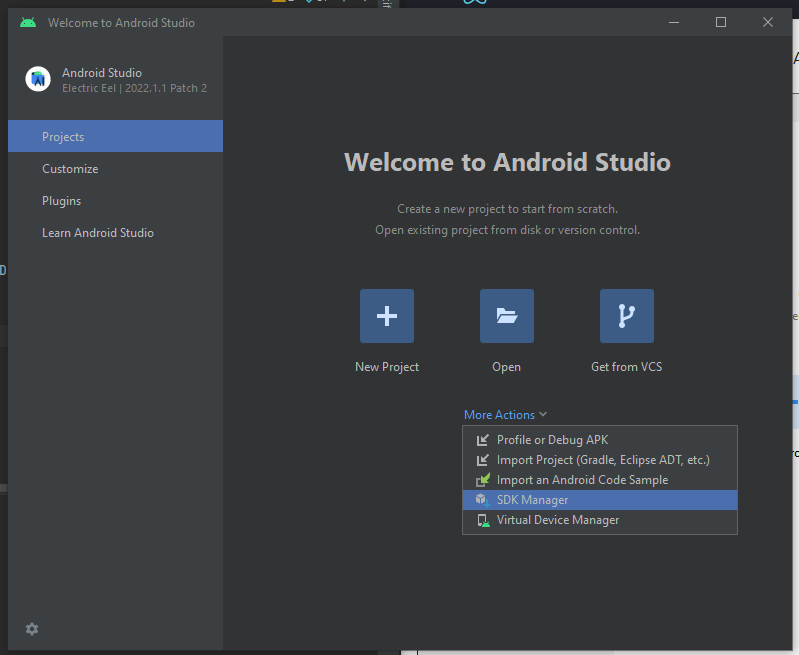

# Setup Môi Trường

[[toc]]

## Setup môi trường Develop

**Expo** cho phép setup môi trường nhanh, nhiều [features](https://docs.expo.dev/), [Snack](https://snack.expo.dev/) để
dùng ngay trên web

**React Native CLI** kết hợp với XCode hoặc Android Studio phải config lâu hơn

### Expo Go Quickstart

<code-group>
<code-block title="NPM" active>
```bash
npx create-expo-app TenProject

cd TenProject
npx expo start
```
</code-block>

<code-block title="YARN">
```bash
yarn create expo-app TenProject

cd TenProject
yarn expo start
```
</code-block>
</code-group>

#### Chạu ứng dụng React Native của bạn

Cài app [Expo Go](https://expo.dev/client) trên điện thoại + kết nối cùng mạng với máy tính, rồi quét mã QR app vừa chạy sinh ra

#### Sửa app

Giờ thử sửa text trong `App.js` app sẽ được tự reload update thay đổi

#### Giải thích thêm

[Expo docs](https://docs.expo.dev/)

[Expo Discord](https://chat.expo.dev/)

[Expo Issue](https://github.com/expo/expo/issues)

#### Chạy trên giả lập hoặc thiết bị ảo

##### Cài Node, JDK

##### Cài Android Studio

##### Cài Android SDK

Mặc dịnh Android Studio đã cài đặt latest version Android SDK.

Ta có thể config lại như sau:
`More Actions` -> `SDK Manager`


SDK platforms: Chọn phiên bản SDK mong muốn

SDK Tool chọn:
- Android Emulator
- Android SDK Platform-Tools
- Google play services

`More Actions` -> `Virtual Device Manager`: tạo và chạy máy ảo

- Sau khi chạy máy ảo lên -> vào project -> `npm start` -> nhấn chữ `a` để chạy trên máy ảo

#### Hạn chế

Expo cung cấp các Expo SDK sẵn để bạn bắt đầu project nhanh hơn, cài module chỉ cần `npx expo install` và reload lại app

Nhưng vì vậy expo ko cho viết thêm native code vào Expo project. Để thêm thư viện không có trong Expo SDK, hoặc thư viện bạn tự viết bạn phải dùng [development builds](https://docs.expo.dev/development/introduction/) hoặc [prebuild](https://docs.expo.dev/workflow/prebuild/) hoặc cả 2. Đọc thêm [các thêm thư viện vào project tạo bởi create-expo-app](https://docs.expo.dev/workflow/customizing/)


### React Native CLI Quickstart

Nghiên cứu sau

## Tích hợp với Apps đã có

Nghiên cứu sau

## Tích hợp với Android Fragment

Nghiên cứu sau

## Xây dựng cho thiết bị TV

Nghiên cứu sau

## Out-of-Tree Platform

Ngoài android và IOS thì có 1 số nền tảng đc React Native hỗ trợ không chính thức. [Bài viết](https://reactnative.dev/docs/out-of-tree-platforms) đưa ra tài liệu tham khảo về phần này
